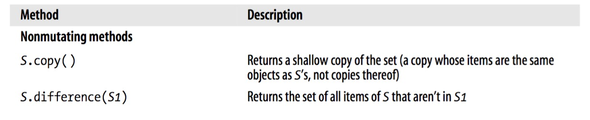
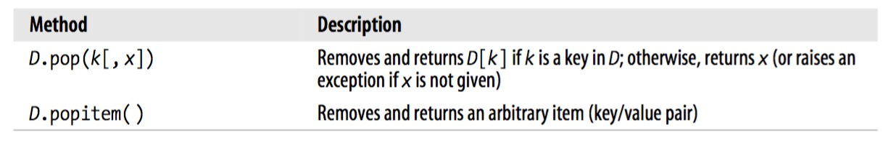

## Table of Contents

1. [__Data Structures__](#Data Structures)
 1. [__List Methods__](#list-methods)
 2. [__Set Methods__](#set-methods)
 3. [__Dictionary Methods__](#dictionary-methods)
2. [__Control Flow Statements__](#control-flow-statements)
 1. [__The if Statement__](#the-if-statement)
 2. [__The while Statement__](#the-while-statement)
 3. [__The for Statement__](#the-for-statement)
 4. [__The break Statement__](#the-break-statement)
 5. [__The continue Statement__](#the-continue-statement)
 6. [__The pass Statement__](#the-pass-statement)
 7. [__The for-else Statement__](#the-for-else-statement)
3. [__Python Classes__](#python-classes)


## List Methods
A *list* is a mutable ordered sequence of items. The items of a list are arbitrary objects and may be of different types. Lists are defined by square brackets and each element is separated by a comma.

Let's look at methods associated with lists


## Set Methods
In Python `set` and `frozenset` represent arbitrarily unordered collection of unique items. Set objects provide several methods as shown below.




>**All mutating methods of set objects, except `pop`, return None**

## Dictionary Methods

A *mapping* is an arbitrary collection of objcts indexed by nearly arbitrary values called *keys*. Mappings are mutable and, unlike sequences, are *not* ordered.

Python provides a single built-in mapping type, the dictionary type. The dictionary in python consists of key-value pairs. Python provides various methods associated with dictionaries.




## Control Flow Statements

A program's control flow is the order in which the program's code executes. The control flow of a Python program is regulated by conditional statements, loops, and function calls.

### The if Statement
The `if` statement also with if-else statement has the following form:

```python
if expression:
    statement(s)
elif expression:
    statements(s)
else:
    statement(s)
```

>**There can be unlimited number of elif statements after if and before else.**

### The while Statement
The `while` statement in Python supports repeated executions of a statement or block of statements that are controlled by a conditional expression. The general syntax is the following:

```python
# Form 1:
count = 0
while count < 10:
    do something
    count += 1

# Form 2:
while True:
    message = raw_input("Enter a number: ")
    if message == 'q':
        print "I am done"
        break
```

The *form 2* can go on infinitely under the user decides to quit while the *form 1* only runs for a specific number of times.

### The for Statement
The `for` statement in Python supports repeated execution of a statement, or block of statements, controlled by an iterable expression. Here's how a for statement looks like:

```python
colors = ['yellow', 'pink', 'blue', 'green']

for color in colors:
    print color
    print len(color)

#If you have a dictionary, you can run through the key-value pairs as follows:

for key, value in d.iteritems():
    print key, value
    if key != value:
        del d[key]
```

### The break Statement
The break statement is allowed only inside a loop body. When `break` executes, the loop terminates. If a loop is nested inside other loops, the `break` in it terminates only the innermost nested loop. We have already seen an example of `break` inside a `while` loop.

### The continue Statement
The `continue` statement is allowed only inside a loop body. When `continue` executes, the current iteration of the loop body terminates, and executing continues with the next iteration of the loop. Here's an example:

```python
for x in xrange(10):
    if x%2 == 0:
        continue
    print x
```
This loop will only print odd numbers as the if statement will set things to continue.

### The pass Statement
The body of a Python compound statement cannot be empty; it must always contain at least one statement. You can use a `pass` statement, which performs no action, as a placeholder when a statement is syntactically required but you have nothing to do.

The for-else Statement
`while` and `for` statements may optionally have a trailing `else` clause. The statement or block under that `else` executes when the loop terminates naturally but not when the loop terminates prematurely. For example:

```python
for num in xrange(10):
    if num == 5: break
else:
    print("executed all the numbers")
```
In this case, the else statement will not print as xrange(10) has the number 5 in it.

## Python Classes

Python is an object-oriented programming languge, which means it manipulates programming constructs called **objects**. You can think of an object as a single data structure that contains data as well as functions; functions of objects are called **methods**.

A basic class consists only of the `class` keyword, the name of the class, and the class from which the new class **inherits** in parentheses. Our classes will inherit from the `object` class like so:

```python
class NewClass(object):
    # Class commands here
```

In addition to the object we write in the class, we also make use of the `__init__()` function. This function required for classes, and it's used to **initialize** the objects it creates. The `__init__()` function always takes at least one argument, `self`, that refers to the object being created. You can think of `__init__()` as the function that 'boots up' each object the class creates. So for example, we will have:

```python
class Animal(object):
    def __init__(self, name):
        self.name = name
```
The `self` is used by Python to refer to the object being created. This is why it is often called `self`, since this parameter gives the object being created its identify.

Once we have created a class as seen above, we can start to instantiate (create) our first object. Let's use the Animal class and create an animal with a name:

```python
class Animal(object):
    def __init__(self, name):
        self.name = name

kangaroo = Animal('Amanda')
# This command will print the name
print kangaroo.name
```
Now the first argument in an `__init__()` gets is used to refer to the instance object, and by convection that argument is called `self`. If you add additional arguments --for instance name, and age for your object--setting each of those equal to self.name and self.age in the body of the `__init__()` will make it so that when you create an instance object of your `Animal` class, you need to give each instance a name, and age, and those will be associated with the particular instance you create. For example,

```python
class Animal(object):
    def __init__(self, name, age):
        self.name = name
        self.age = age

kangaroo = Animal('Amanda', 2)
# This command will print the name
print kangaroo.name
print kangaroo.age
```

Another important aspect of Python classes is scope. The scope of a variable is the context in which it's visible to the program. Variables that are available everywhere are called **global variables** while those that are only available to members of a certain class are called **member variables**. Variables that are only available to particular instance of a class are called **instance variables**. For example, the variable `is_alive` is a global variable as it is available to all the objects created in the class.

```python
class Animal(object):
    """Makes cute animals."""
    is_alive = True
    def __init__(self, name, age):
        self.name = name
        self.age = age
```

When a class has its own functions, those functions are called **methods**. We have already seen `__init__()` method. But we can have more. Here `description()` is another method. Note that methods have parentheses while variables such as global variables do not.

```python
class Animal(object):
    """Makes cute animals."""
    is_alive = True
    def __init__(self, name, age):
        self.name = name
        self.age = age
    # Add your method here!
    def description(self):
        print self.name
        print self.age

hippo = Animal("Shere Khan", 35)
hippo.description()
hippo.is_alive
```

**Inheritance** is the process by which one class takes on the attributes and methods of another, and it's used to express an **is-a** relationship. For example, a 'Panda is a bear', so a Panda class could inherit from a Bear class. However, Toyota is not a Tractor so it cannot inherit from a Tractor class. But both Toyota and Tractor are vehicles and so they both inherit from the Vehicle class. In Python, inheritance has a general structure such as:

```python
class DerivedClass(BaseClass):
    # code here
```

Here's another:

```python
class Shape(object):
    """Makes shapes!"""
    def __init__(self, number_of_sides):
        self.number_of_sides = number_of_sides

class Triangle(Shape):
    def __init__(self, side1, side2, side3):
        self.side1 = side1
        self.side2 = side2
        self.side3 = side3
```

Sometimes you'll work on a derived class or **subclass** and realize that you've overwritten a method or attribute defined in that class' base class (also called a parent or **superclass**). YOu can directly access the attributes or methods of a superclass with Python's built-in `super` call. Here's an example:

```python
class Employee(object):
    """Models real-life employees!"""
    def __init__(self, employee_name):
        self.employee_name = employee_name

    def calculate_wage(self, hours):
        self.hours = hours
        return hours * 20.00

# Add your code below!
class PartTimeEmployee(Employee):
    def calculate_wage(self, hours):
        self.hours = hours
        return self.hours * 12

    def full_time_wage(self, hours):
        return super(PartTimeEmployee, self).calculate_wage(hours)

milton = PartTimeEmployee('Ada')
print milton.full_time_wage(10)
```